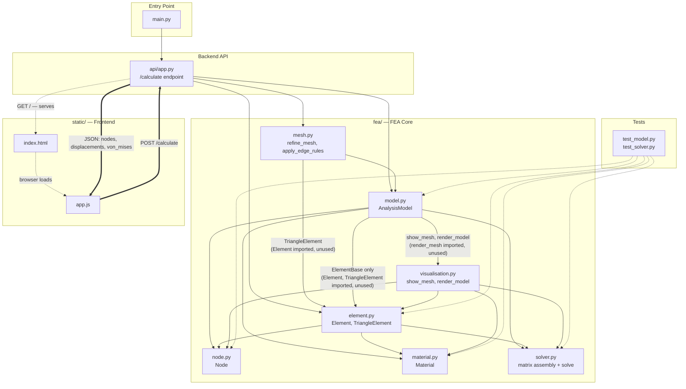
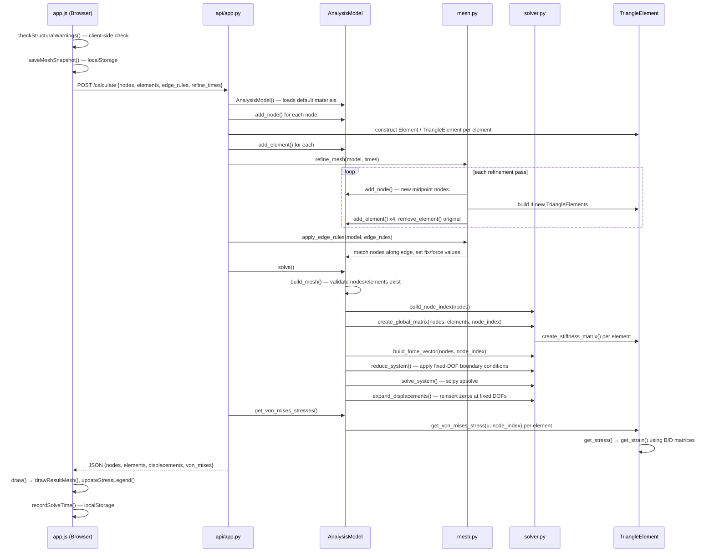

# FEA Sandbox - Interactive Finite Element Analysis Tool

## Overview

A browser-based tool for building 2D triangular meshes and applying loads and constraints, all in real time with stress colouring, deformation and structural warning feedback. No external software required, running locally or in Github codespaces.

## Features
<details>

<summary> Mesh Editing </summary>

Left click in "Add node" mode to freely place nodes or manually enter coordinates. Group nodes into triangular elements directly or create rectangular shapes through 2 triangles by selecting corner nodes.

</details>
<details>

<summary>Boundary Conditions & Loads</summary>
Right click a node or element edge to either fix it in the X/Y direction, apply a point force, or evenly distribute force along an edge. Edited nodes and elements are colour coded by property (green = fixed, orange = force).

</details>
<details>

<summary>Mesh Refinement</summary>
Subdivide the mesh before solving with a configurable level of refinement up to 4^8 triangles per element. Warning messages are shown above a certain threshold as refinement grows element count exponentially so can lead to long processing time.

</details>
<details>

<summary>Solving</summary>
When "calculate" is pressed, the mesh is sent to a Python backend, which assembles a global stiffness matrix as a sparse COO matrix, converts it to CSR for boundary condition reduction and solves it with SciPy's sparse solver (spsolve).

</details>
<details>

<summary>Stress Visualization</summary>
Stress is conveyed through a colour-mapped overlay with a live legend, with a toggle for linear as well as logarithmic scaling so stress distribution is visible even when outliers may wash out colour discepancies in linear mode.

</details>
<details>

<summary>Deformed Shape Preview</summary>
Toggle between the orginal and deformed mesh, with a configurable slider to exaggerate the deformation where it may not be visible for smaller forces.

</details>
<details>

<summary>Structural warnings</summary>
Before solving a check is run for unconstrained structures or connections around single nodes (articulation points) in order to prevent unintended results (these warnings are permanently dismissable).

</details>
<details>

<summary>Crash Recovery / Session Persistence</summary>
Upon solving, reloading or exiting the page the current mesh is snapshotted to local storage, so a reload or crash prompts a message to recover the mesh as a precaution.

</details>


## Screenshots / Demo

## Getting Started
### Prerequisites
```
Python 3.12+
pip
```
### Installation
```
git clone (https://github.com/Ben-H-2/2D-FEA-Sandbox).git
cd 2D-FEA-Sandbox
pip install -r requirements.txt
```
### Running 
```
python main.py
```
This will print out the current status of the http://localhost:8000 in the terminal as well as a link to the interactive browser window.

## Usage
### Placing Nodes
### Creating Elements (Triangle / Rectangle)
### Setting Fixed Constraints
### Applying Forces
### Editing Edge Rules
### Refining the Mesh
### Running a Calculation
### Interpreting the Stress Legend
### Toggling Views (Stress / Outlines / Deformation / Scale Mode)
### Hovering for Point Stress Values

## How It Works
### Mesh Data Model (Nodes, Elements, Edge Rules)
### Refinement Algorithm
### Structural Warnings (Articulation Points, Unconstrained Structures)
### Solve Request / Response Format
### Stress Colour Mapping (Linear vs Logarithmic)
### Solve Time Estimation

## Known Limitations
- No material property support yet (assumes steel)
- No persistent save/load to file 

## Roadmap
- [ ] Material properties
- [ ] Save/load mesh to file
- [ ] Pyvista implementation

## Project Structure
### Module Dependency Graph

* Solid → = real Python import, actively used
* Dashed -.→ = file served / loaded by the browser, not a Python import
* Thick ⇒ = live HTTP request/response between browser and server
* Dotted Tests -.→ = imported only by test files, not part of the production runtime path
### Calculation Sequence 

## Configuration / Constants Reference

## License