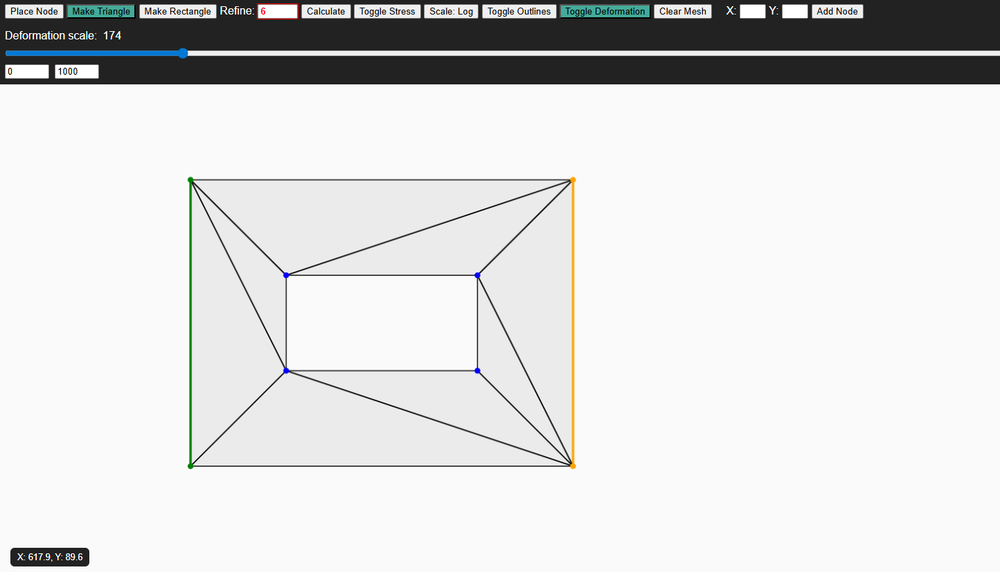
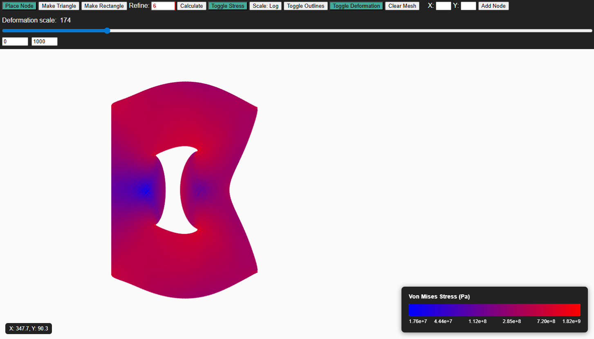
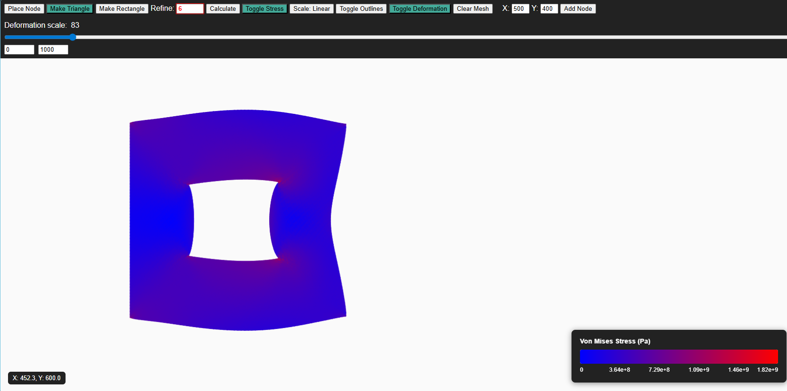
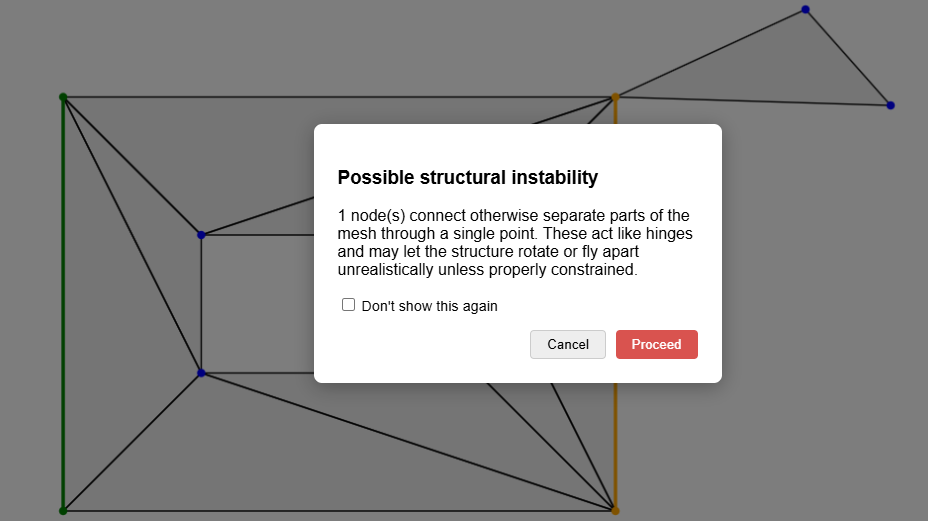
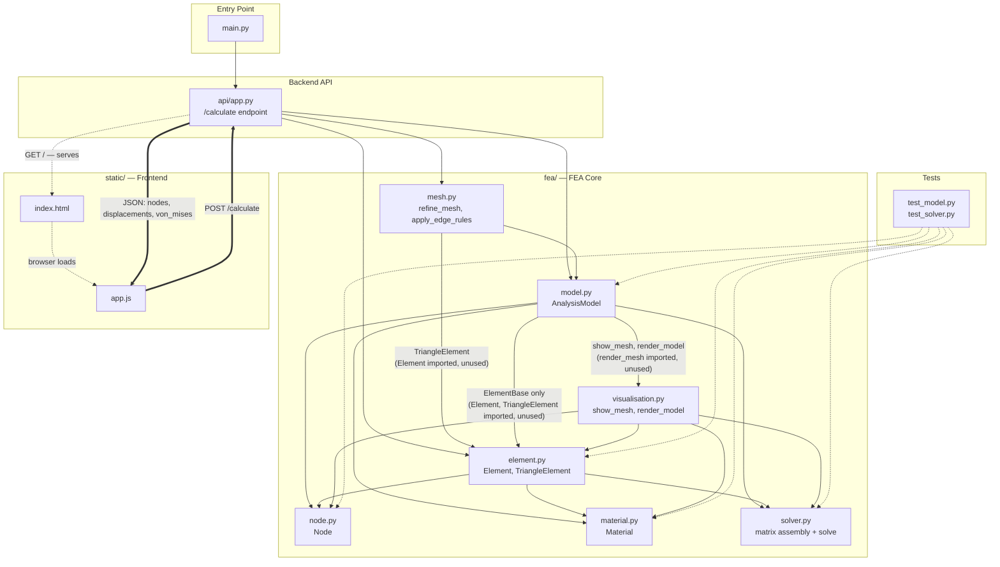
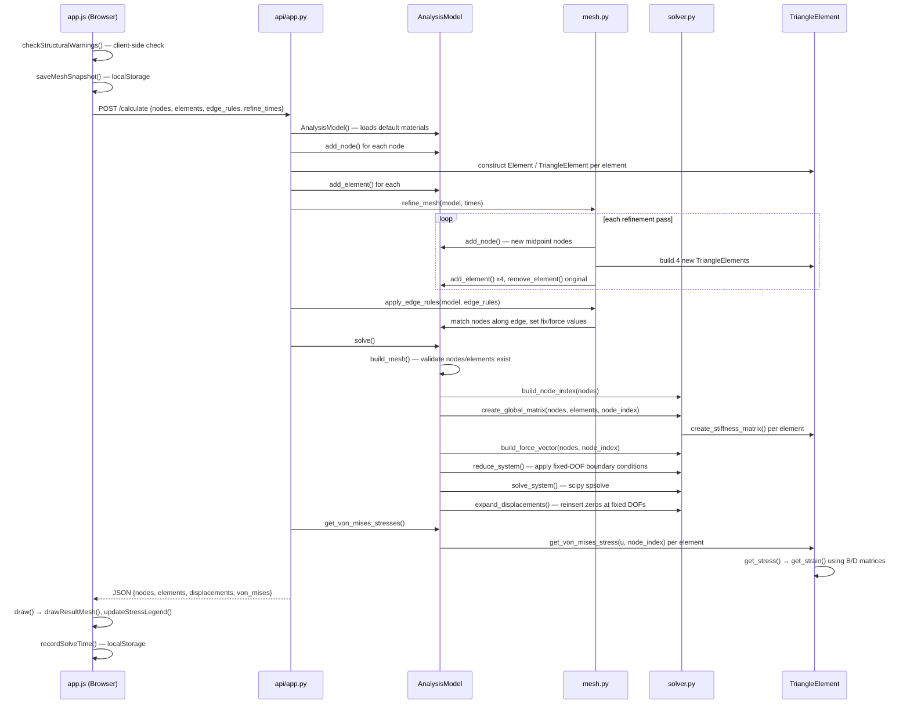

# FEA Sandbox - Interactive Finite Element Analysis Tool
**A browser-based tool for building 2D triangular meshes and applying loads and constraints, all in real time with stress colouring, deformation and structural warning feedback. No external software required, running locally or in Github codespaces.**

## Features
<details>

<summary> Mesh Editing </summary>

Left click in "Add node" mode to freely place nodes or manually enter coordinates. Group nodes into triangular elements directly or create rectangular shapes through 2 triangles by selecting corner nodes.

</details>
<details>

<summary>Boundary Conditions & Loads</summary>
Right click a node or element edge to either fix it in the X/Y direction, apply a point force, or evenly distribute force along an edge. Edited nodes and elements are colour coded by property (green = fixed, orange = force).

</details>
<details>

<summary>Mesh Refinement</summary>
Subdivide the mesh before solving with a configurable level of refinement up to 4^8 triangles per element. Warning messages are shown above a certain threshold as refinement grows element count exponentially so can lead to long processing time.

</details>
<details>

<summary>Solving</summary>
When "calculate" is pressed, the mesh is sent to a Python backend, which assembles a global stiffness matrix as a sparse COO matrix, converts it to CSR for boundary condition reduction and solves it with SciPy's sparse solver (spsolve).

</details>
<details>

<summary>Stress Visualization</summary>
Stress is conveyed through a colour-mapped overlay with a live legend, with a toggle for linear as well as logarithmic scaling so stress distribution is visible even when outliers may wash out colour discepancies in linear mode.

</details>
<details>

<summary>Deformed Shape Preview</summary>
Toggle between the orginal and deformed mesh, with a configurable slider to exaggerate the deformation where it may not be visible for smaller forces.

</details>
<details>

<summary>Structural warnings</summary>
Before solving a check is run for unconstrained structures or connections around single nodes (articulation points) in order to prevent unintended results (these warnings are permanently dismissable).

</details>
<details>

<summary>Crash Recovery / Session Persistence</summary>
Upon solving, reloading or exiting the page the current mesh is snapshotted to local storage, so a reload or crash prompts a message to recover the mesh as a precaution.

</details>


## Screenshots
### Outlines toggled on:

### Editor Mode

### Log Colouring Mode

### Linear Colouring Mode

### Example warning


## Getting Started
### Prerequisites
```
Python 3.12+
pip
```
### Installation
```
git clone (https://github.com/Ben-H-2/2D-FEA-Sandbox).git
cd 2D-FEA-Sandbox
pip install -r requirements.txt
```
### Running 
```
python main.py
```
This will print out the current status of the http://localhost:8000 in the terminal as well as a link to the interactive browser window.

## Usage
| Action | How |
|---|---|
| Place a node | Select "Place Node" mode then left click canvas, or enter X/Y and click "Add Node" |
| Create a triangle | Select "Make Triangle" mode then left click 3 existing nodes in sequence |
| Create a rectangle | Select "Make Rectangle" mode → click 2 nodes as opposite corners |
| Fix a node | Right-click node and check Fix X / Fix Y |
| Apply a force | Right-click node and enter Force X / Force Y |
| Fix/load a whole edge | Right-click an element edge (not a node) and fix/apply force same as nodes|
| Refine the mesh | Set "Refine" value before calculating, ranges from 1-8 |
| Run a solve | Click "Calculate" |
| Read stress values | Toggle "Scale: Linear/Log", hover over solved mesh to read the stress at that point |
| View element borders | Toggle the "Toggle Outlines" button |
| Preview deformation | "Toggle Deformation" + deformation scale slider |
 
### Notes:
- **Interpreting the legend:** the color bar maps color to von Mises stress (Pa). Using the log mode can reveal discrepancies in stress more clearly where in linear mode, high stress points may dominate the colouring.
- **Calculation warnings:** if the mesh looks structurally unstable or the refinement level is high, you'll be prompted to confirm before the solve proceeds.
- **Hovering for point stress:** while viewing solved results, hover over any element to see its exact von Mises stress value in a tooltip.

## How It Works
<details>

<summary><strong>Mesh Data Model (Nodes, Elements, Edge Rules)</strong></summary>
- <em>Each node holds an individual position, fixed_x/y, force_x/y and an ID</em>
<br>- <em>Elements reference 3 node IDs as the mesh is entirely comprised of triangles</em>
<br>- <em>Edge rules apply fixed_x/y attributes along all nodes on an edge (including corner nodes) as well as distibuting force evenly </em>

</details>
<details>

<summary><strong>Refinement Algorithm</strong></summary>
- <em>Each refinement pass subdivides each triangle element into 4 new triangles</em>
<br> - <em>Therefore triangle/element count grows at a rate of n * 4^refine_times where n is intital element count</em>
<br> - <em>This explains why refinement above 5 is flagged by red colouring and refinement above 5 for meshes with multiple elements is inadvisable</em>

</details>
<details>

<summary><strong>Structural Warnings</strong></summary>
- <em>Unconstrained Element Check - If there are no fixed nodes or elements deformation would result in the whole mesh moving (effectively dissapearing)</em>
<br> - <em>Articulation Point Detection - If a single node connects 2 otheriwse disconnected regions it can result in innacurate deformation results so this is flagged</em>

</details>
<details>

<summary><strong>Solve Request / Response Format</strong></summary>
- <em>The frontend sends mesh nodes, elements, edge_rules, and refine_times to <code>/calculate</code></em>
<br>- <em>The backend builds an AnalysisModel from the nodes/elements, then applies mesh refinement and edge rules</em>
<br>- <em>model.solve() assembles the global stiffness matrix as a sparse COO matrix, reduces it for boundary conditions, and solves it with SciPy's sparse.linalg.spsolve</em>
<br>- <em>The backend returns solved node positions, displacements, and per-element von Mises stress as JSON, which the frontend uses to render the stress view</em>

</details>
<details>

<summary><strong>Stress Color Mapping (Linear vs Logarithmic)</strong></summary>
- <em>Linear node maps colour directly to stress as a fraction of the maximum</em>
<br> - <em>Logarithmic mode maps the log of the value instead spreading out the colouring and distinguishing stress in low stress regions</em>

</details>
<details>

<summary><strong>Solve Time Estimation</strong></summary>
<em> Solve durations are recorded per post-refinement element count in local storage, and a log-log regression over past solves displays the expected solve time when each solve begins. </em>

</details>


## Known Limitations
- No material property support yet (assumes steel)
- No persistent save/load to file 

## Roadmap
- [ ] Material properties
- [ ] Save/load mesh to file
- [ ] Pyvista implementation
- [ ] Curved lines support

## Project Structure
### File Layout
```
.
├── api/app.py              # FastAPI app, /calculate endpoint
├── fea/
│   ├── model.py             # AnalysisModel: nodes, elements, materials
│   ├── element.py           # Element / TriangleElement definitions
│   ├── node.py               # Node definition
│   ├── material.py           # Material dataclass + defaults
│   ├── mesh.py                # Refinement, edge rule application
│   ├── solver.py               # Sparse stiffness matrix assembly & solve
│   └── visualisation.py         # Backend-side rendering helpers
├── static/
│   ├── index.html             # Frontend UI
│   └── app.js                  # Mesh editor, canvas rendering, solve calls
├── main.py                      # Local/Codespaces entry point
├── test_solver.py
├── test_model.py
└── requirements.txt
```

### Module Dependency Graph

```
 Solid → = real Python import, actively used
 Dashed -.→ = file served / loaded by the browser, not a Python import
 Thick ⇒ = live HTTP request/response between browser and server
 Dotted Tests -.→ = imported only by test files, not part of the production runtime path
```
### Calculation Sequence 

## Configuration / Constants Reference
| Constant | Location | Purpose |
|---|---|---|
| `REFINE_WARNING_THRESHOLD` | `app.js` | Refine value above which the UI warns before solving |
| `MIN_SOLVE_SAMPLES` | `app.js` | Minimum recorded solves needed locally before it estimates solve time |
| `LEGEND_TICK_COUNT` | `app.js` | Number of labels along the colour scale (legend) |
| `PERSIST_DONT_SHOW_AGAIN` | `app.js` | Whether "don't show again" warning dismissals persist across sessions (localStorage) or just the tab (sessionStorage) |
| `SHOW_HOVER_TOOLTIP` | `app.js` | Enables/Disables the tooltip for von mises stress value displaying when the mouse is on the mesh |
| `NODE_SELECTION_RADIUS` | `app.js` | Configures the range around a node where it can be selected |
| `ELEMENT_SELECTION_RADIUS` | `app.js` | Configures the range around an element where it can be selected |
| `NODE_RADIUS` | `app.js` | Configures the size of nodes in the editable mesh |

## Contributing

All contributions are welcome

## License

MIT — see [LICENSE](LICENSE).